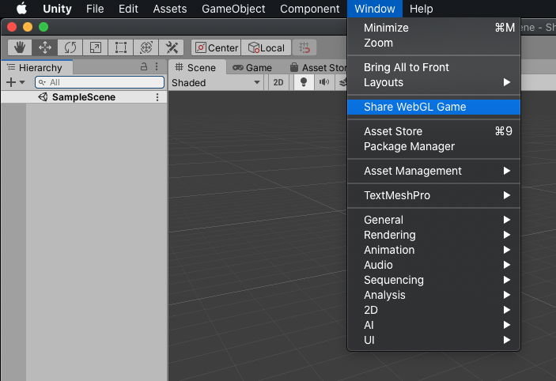
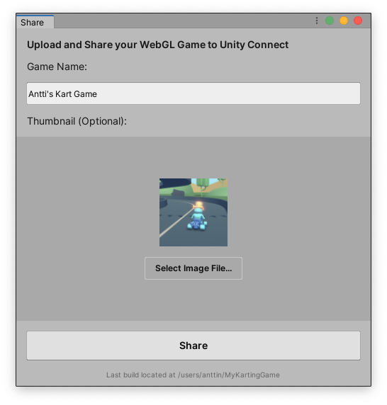
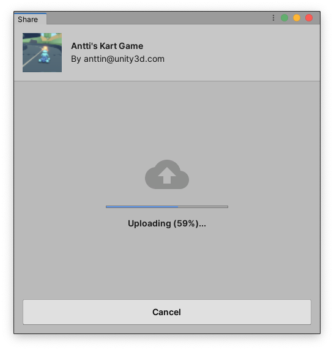
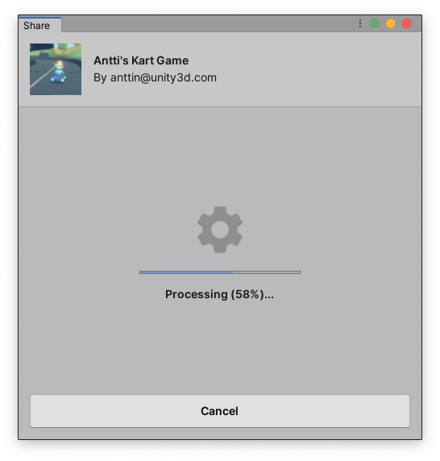
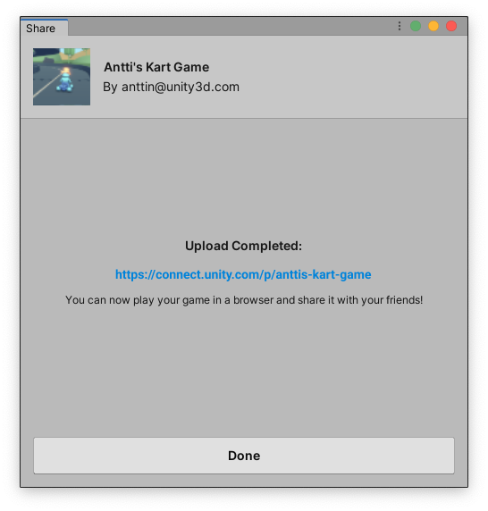
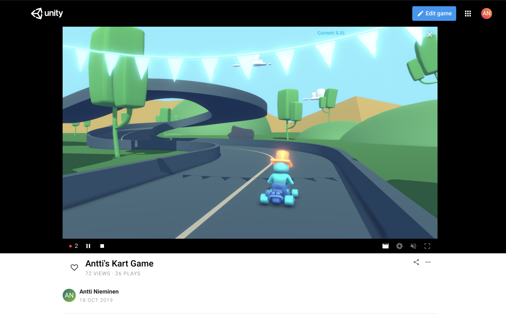

### **_Share WebGL Game_**

Use this package to upload and share your WebGL game on Unity Connect.

### Installation
To add this package your project, go to _Window_ > _Package Manager_ and install the latest version of the package.

## Share WebGL Game
As shown below, once the package is installed into your project, you will find `Share WebGL Game` menu item from the _ Window_ menu.

 Click the `Share WebGL Game` menu item to initiate the upload and share process. The following screens will appear acording to your login and build status.
 - The package will check if you are logged in, if not it will ask you to login.
 - The package will check if you have built the webgl game, if not it will guide you to build the game.
 - Then you can update the project title and upload an thumbnail for the project.
 - After those steps you just need to click the upload button and wait for the game's webpage link.

 
 
 
 
 

# Technical details

## Requirements

This version of Share WebGL Game is compatible with the following versions of the Unity Editor:

* 2019.3 and later
