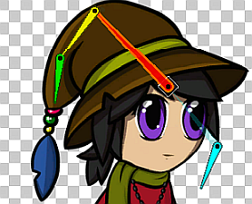
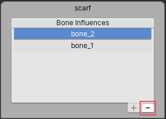

# Actor skinning and weighting workflow
The following steps are the general workflow for preparing your actor for animation with the Skinning Editor, after you have [imported](PreparingArtwork.md) it into Unity. Follow the steps below to create the bones, generate the meshes, and adjust the weights for your actor. For more specific samples and examples, refer to the samples distributed with the 2D Animation package and the sample documentation included [here](#Examples.md).

1. Use the [Create Bone](SkinEdToolsShortcuts.md#bone-tools) tool to build the bones of the actor skeleton:

   - With the tool selected, click to define the start-point of the bone. Then move the cursor to where the bone should end, and click again to set the bone’s end-point.

   - After creating a bone, the tool allows you to set the end-point of the second bone and so on, in order to create a chain of bones.

   - To continue a chain of bones from any bone, select the __Create Bone__ tool and click an existing bone, then click its end-point. A new bone is started from the end-point, creating a chain.

   - Alternatively, you can set the start-point of the new bone away from its parent bone. The child bone still belongs to the same chain and this is reflected in the [bone hierarchy](SpriteVis.md#bone-tab-and-hierarchy-tree).

       A faded link shows the red and blue bones are connected in a chain.

1. After creating the bones of the actor, generate the geometry Mesh for the __Sprites__. It is recommended to use the [Auto Geometry](SkinEdToolsShortcuts.md#geometry-tools) tool to auto-generate the geometry Mesh.

   - With the __Auto Geometry__ tool selected, select a Sprite and then select the __Generate For Selected button__ to generate a Mesh for that Sprite only. To __Generate For All Visible Sprites__, click the generate button without selecting any Sprite.

1. Refine the generated Meshes further by using the [Edit Geometry](SkinEdToolsShortcuts.md#geometry-tools) Geometry tool, or create your own Mesh outline with the [Create Vertex](SkinEdToolsShortcuts.md#geometry-tools) and [Create Edge](SkinEdToolsShortcuts.md#geometry-tools) Geometry tools.

1. [Paint weights](SkinEdToolsShortcuts.md#weight-tools) onto the Sprite geometry to adjust how much influence a bone has on the vertices of the Mesh. This affects how the mesh deforms when the actor is animated. It is recommended to use the [Auto Weights](SkinEdToolsShortcuts.md#weight-tools) tool to auto-generate the weights. The __Auto Weights__ tool only generates weights for Sprites that have both a geometry Mesh, and bones intersecting their Mesh:

   - The __Generate For All Visible__ button is available when you do not select any specific Sprite. Select it to generate weights for all valid Sprite Meshes in the editor.
   - The __Generate For Selected__ button is available when you have a Sprite selected in the editor. Select it to generate weights for only the selected Sprite.

1. Use the [Weight Slider](SkinEdToolsShortcuts.md#weight-slider) and [Weight Brush](SkinEdToolsShortcuts.md#weight-brush) tools to further adjust the weights of the Mesh vertices.

1. To edit which bones influence a Sprite, select it and then go to the [Bone Influence](SkinEdToolsShortcuts.md#bone-influence) tool. A list of bones currently influencing the Sprite’s Mesh are listed in this panel at the bottom-right of the editor.

   - To remove a bone, select it from the list and select __Remove (-)__ at the bottom right of the list.

       Select __Remove (-)__ at the bottom right of the panel.

   - To add a bone as an influencer to the currently selected Sprite Mesh, select the bone in the editor window and select __Add (+)__ to add it to the list.

1. Test your rigged actor by posing it with the [Preview Pose](SkinEdToolsShortcuts.md#preview-pose) tool. Move and rotate the different bones to check that the geometry Mesh deforms properly. Previewing poses can also be done while the following tools are selected: the __Weight Brush__, __Weight Slider__, __Bone Influence__, __Auto Weights__, and __Visibility__ tools.

   - To restore a rigged actor to its original pose, select __Reset Pose__ from the [Editor toolbar](SkinEdToolsShortcuts.md#editor-toolbar).
   - Edit the default pose by moving the actor bones and joints with the [Edit Bone](SkinEdToolsShortcuts.md#editor-toolbar) tool.

After you have completed rigging your actor, you are now prepared to animate.
