# Sprite Library Asset

A Sprite Library Asset groups multiple Sprites into **Categories**. It is used in combination with the [Sprite Library]() component and [Sprite Resolver]() component to swap Sprite visuals at runtime.

To create a __Sprite Library Asset__, go to __Assets__ > __Create__ > **2D** > __Sprite Library Asset__.

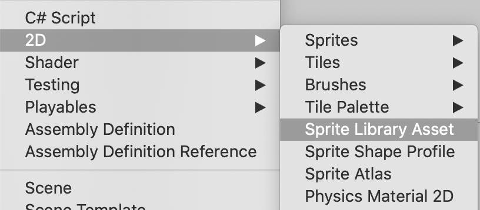

## Sprite Library Asset inspector

Once the Sprite Library Asset is created, select the Asset and go to its inspector window.

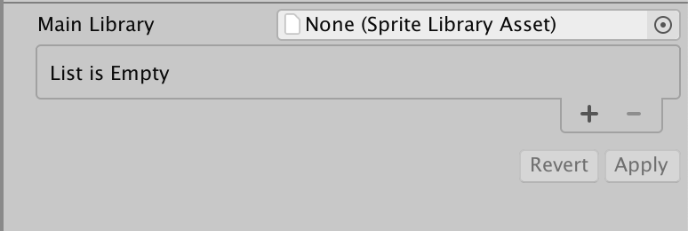 Sprite Library Asset properties
Property  |Function  
--|--
**Main Library**  |  Assign another Sprite Library Asset here to have it become the 'master' library of the current Sprite Library Asset. The current Sprite Library Asset becomes a variant of the **Main Library**, and allows it to access the Categories and Entries of the **Main Library** Asset. Refer to [this section](#main-library) for more information about the functions and limitations of this feature.
**List**  |   Lists the [Categories](#category) contained in the Sprite Library Asset. Select **+** to add a new Category or **-** to remove the currently selected Category from the Sprite Library Asset.
**Revert**  |  This resets all Categories and Entries back to the last saved state. Unsaved changes are removed.
**Apply**  |  This saves the current state of Entries and Categories in the Sprite Library Asset.

##Category
A Category contains selected Sprites that have been grouped together for a common purpose.    

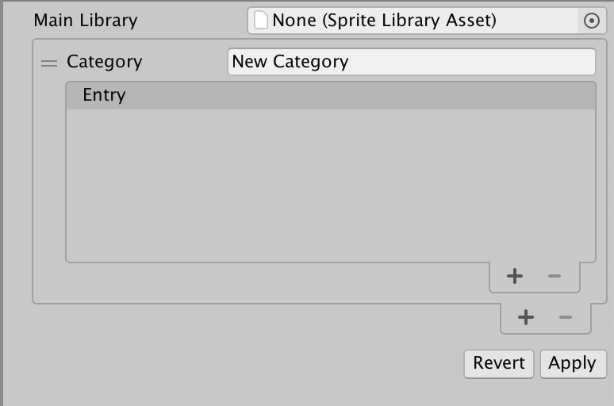 Category window
Property  |Function  
--|--
**Category**  |Enter a unique name for this Category.  
**Entry**  | Displays the currently included Sprites in this Category as thumbnails. Select **+** to add a new Sprite to this Entry, or **-** to remove the currently selected Sprite.

###Entry
The Entry displays the Sprites contained in the selected Category.

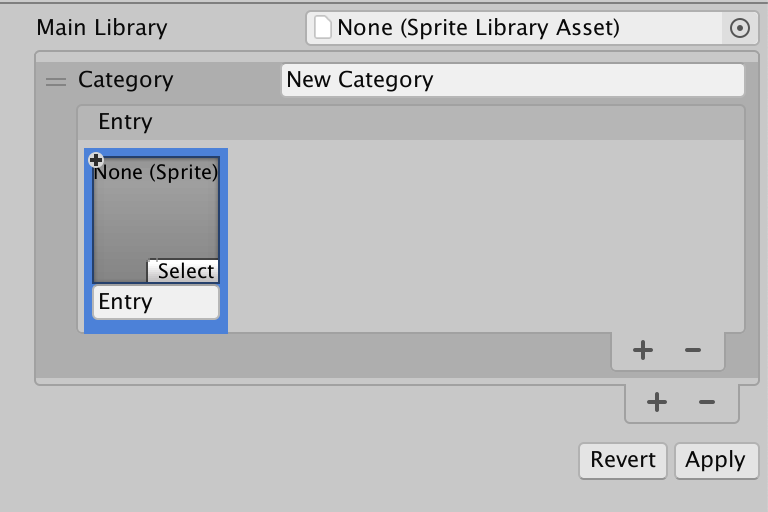 Selecting **+** adds a blank selection to the Entry.

Property  |Function  
--|--
**Select**  |  Click this to open the object picker window and select a Sprite for this selection.
**(Name)** | The name of this selection within the Entry. The default name is 'Entry'.

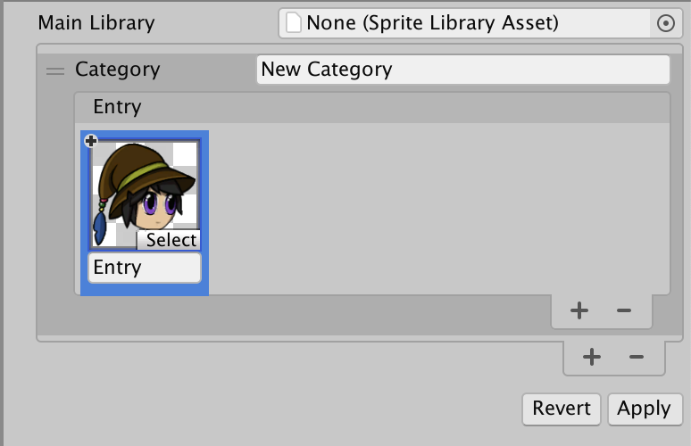 The selection after selecting a Sprite.

After selecting the Sprites and entering any changes, select **Apply** to ensure these changes are saved.

## Main Library

Assigning another Sprite Library Asset to the **Main Library** property of the current Sprite Library Asset allows the current Asset to access all Categories and Entries contained in the 'master library'.

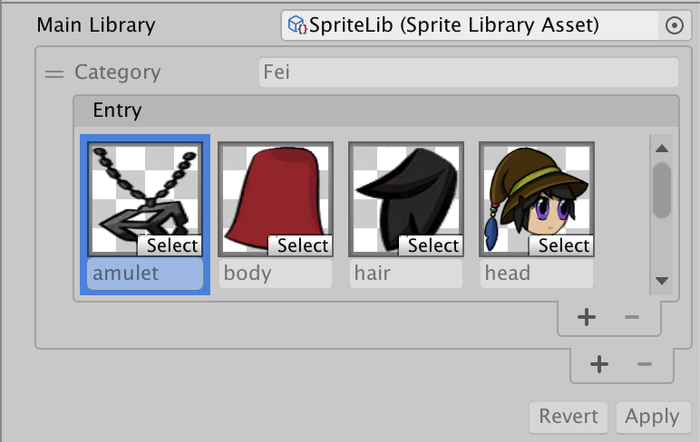 Sprite Library Asset showing the Categories and Entries retrieved from the **Main Library** property.

The names of the categories and entries retrieved from the Main Library property cannot be changed. These categories and entries cannot be removed as well.

Users are allowed to add new entries into a category that is retrieved from the Main Library property.

Users are also allowed to change the Sprite an entry is referring to. To remove the change, click on the inner ‘-’ button and it will restore back to the one that is retrieved from the Main Library property.

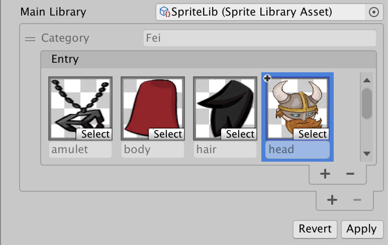 Sprite Library Asset showing the Sprite of an entry has been modified.

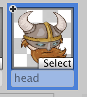

There will be a ‘+’ icon indicator on the Sprite when

1. The entry is added from the Sprite Library Asset

2. The entry is retrieved from the Main Library property and the Sprite the entry is referring to has been changed.

When assigning a Sprite Library Asset to the Main Library property, if the same category name already exists in current Sprite Library Asset, the entries from both categories will be merged into one category.

Similarly, any entries in the same category that have the same name, will be merged and the entry will use the Sprite that was referred to in the current Sprite Library Asset.

When a Sprite Library Asset is removed from the Main Library property, changes that are made on the current Sprite Library Asset will remain.

## Drag and Drop

You can quickly populate categories and entries by drag and dropping Sprites into the Sprite Library Asset’s inspector

Dragging Sprites and Texture into empty space of the Inspector list will automatically create a new category and entry. The Sprite’s name will be used as the default name for the category and entry created.

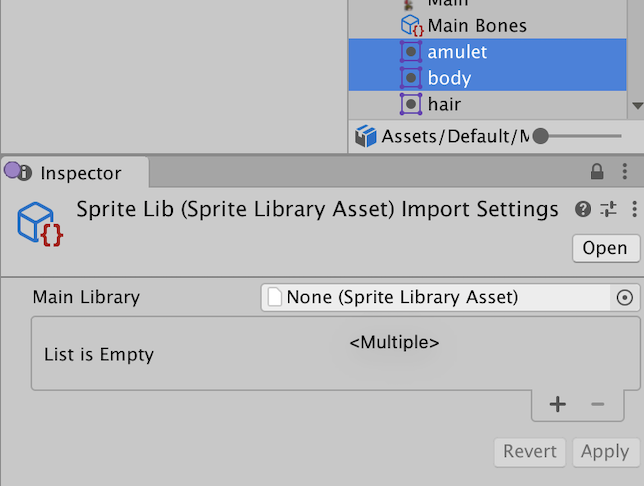

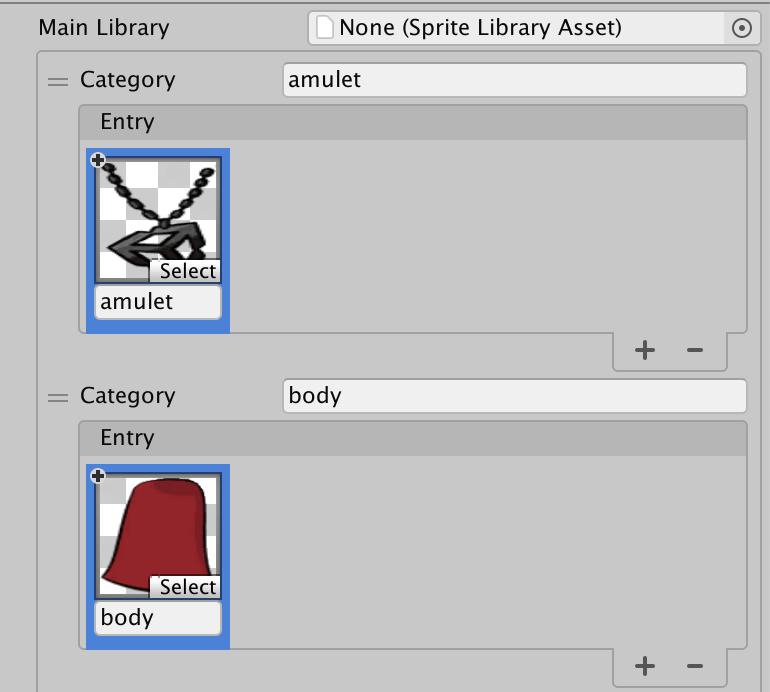

If a Category name matches the name of the Sprite, the Sprite will be added into the category instead

You can also quickly populate a category by dragging and dropping Sprites into the category itself.

## Sprite Library component

The Sprite Library component is used to define which Sprite Library Asset to use at runtime. Attach this component to a GameObject or any parent GameObject of a Sprite Resolver component to allow the [Sprite Resolver](#sprite-resolver) to change the Sprite that is being used by a [Sprite Renderer](https://docs.unity3d.com/Manual/class-SpriteRenderer).

In the Sprite Library component’s inspector, you can assign the desired Sprite Library Asset to use.

By assigning a Sprite Library Asset, the component’s Inspector will show a preview of the content in the Sprite Library Asset

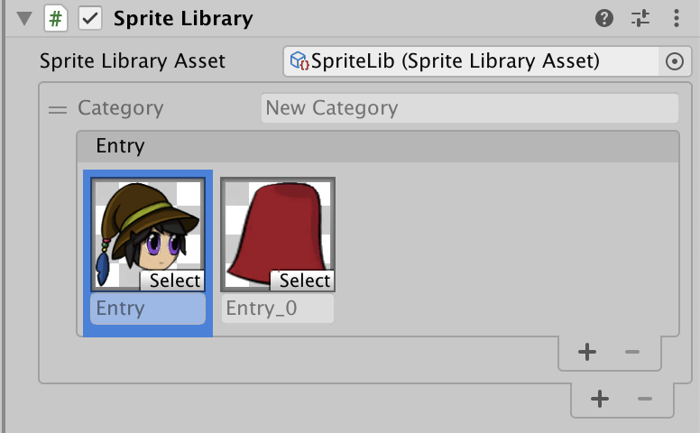

Similar to the Sprite Library Asset’s inspector, the Sprite Library component's inspector also allows users to add new categories, change the Sprite an entry is referring to and add a new Sprite entry into the category.

## Sprite Resolver

The Sprite Resolver component is attached to each GameObject in the Prefab. The component pulls information from the [Sprite Library Asset](SLAsset.md) (assigned to the [Sprite Library component](SLComponent.md) at the root of the Prefab). The component contains two properties - [Category and Label](SpriteVis.html#sprite-tab) - and a visual Variant Selector that displays thumbnails of the Sprites contained in the Sprite Library Asset.

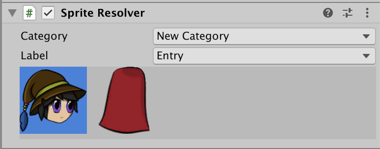 Inspector view of Sprite Resolver component.

| Property     | Function                                                     |
| ------------ | ------------------------------------------------------------ |
| __Category__ | Select which Category you want to use a Sprite from for this GameObject. |
| __Label__    | Select the Label of the Sprite you want to use for this GameObject. |

Select the Sprite you want the **Sprite Renderer** to render by selecting from the **Category** and **Label** dropdown menus, or select the Sprite directly in the visual Variant Selector.

### Sprite Resolver animation keyframe changes in version 6.0

The Sprite Resolver has been changed so that when it is being keyframe in Animation Window, only 1 property change will be recorded as compared to 2 previously.

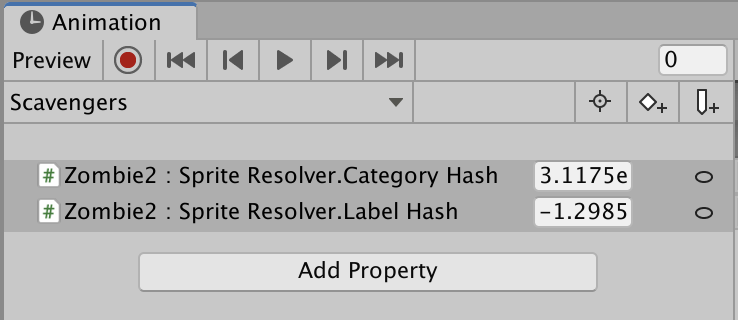 The previous Sprite Resolver key.

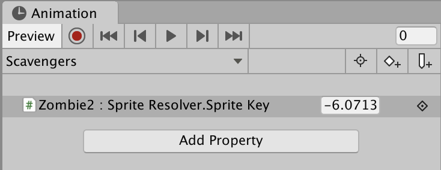 The Sprite Resolver key from Animation 6.0 onwards.
