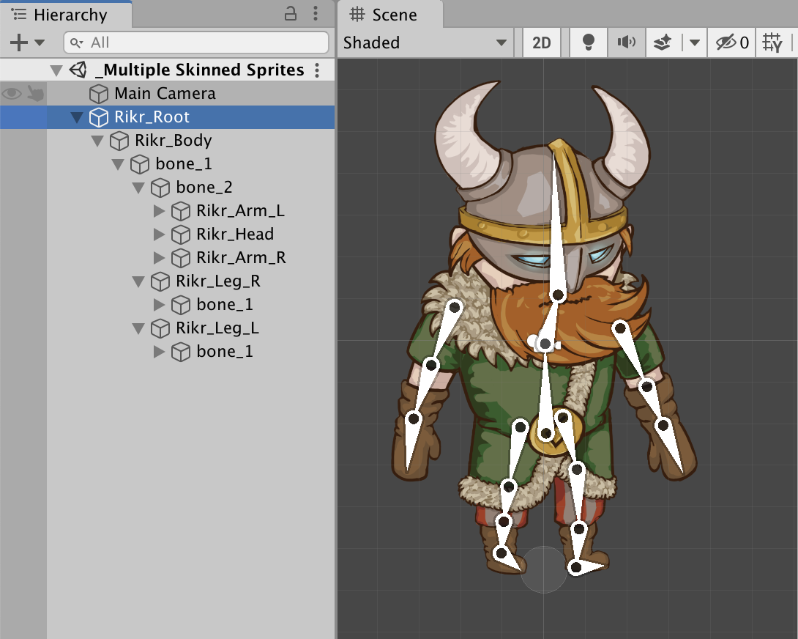
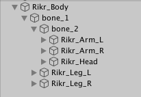
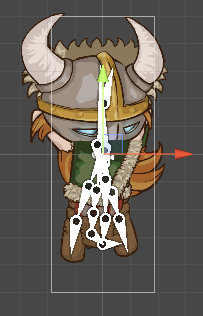

# Multiple Sprites from a single imported Texture

This sample shows a rigged character that is made out of multiple Sprites. The Sprites are from a single image imported with the Texture Importer set to **Multiple Sprite Import** mode.

To view how the Sprite is rigged, open the Asset *Assets/Samples/2D Animation/[X.Y.Z]/Samples/3 Multiple Skinned Sprites/Sprites/Rikr.png* in the Skinning Module.

The *_Multiple Skinned Sprites* sample Scene shows how the Asset is used in a Scene with animation using deformation.

The following are the steps to reconstruct the *_Multiple Skinned Sprites Sprite* sample Scene:

1. For each Sprite in *Rikr *Asset:

   1. Create a GameObject with a Sprite Renderer referencing the Sprite.
   2. Add a Sprite Skin component and select the **Create Bones** button.
      

2. Reconstruct the character’s hierarchical structure so that the part of the character moves in conjunction with the body part it is supposed to link to. For example, when the body is moving, the rest of the character part should follow.

   - Using *Rikr_Body* as the root, place *Rikr_Leg_L* and *Rikr_Leg_R* GameObject as children of *Rikr_Body/bone_1*

   - Using *Rikr_Body* as the root, place *Rikr_Arm_L*, *Rikr_Arm_R* and *Rikr_Head* GameObject as children of *Rikr_Body/bone_2*

     

3. Place the GameObjects with Sprite Renderers so that they are aligned correctly. To control the Sprite drawing order, specify the **Order In Layer** value in Sprite Renderer.

   

4. Create another GameObject at the root and call it Rikr_Root. Reparent the Rikr_Body GameObject to be a child of Rikr_Root.
5. Add an Animator component to the Rikr_Root GameObject and assign the Rikr Animator Controller Asset to the Controller property. The Animator Controller Asset is located at *Assets/Samples/2D Animation/[X.Y.Z]/Samples/3 Multiple Skinned Sprites/Animation/Animator/Rikr*
