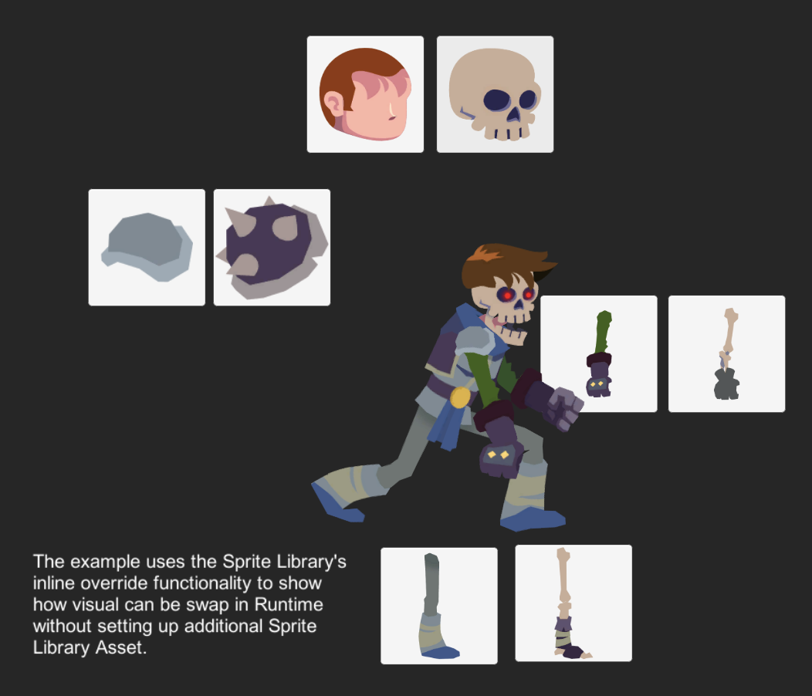

# Runtime Swap

This example shows how to use the Sprite Library API to override an entry. The example requires the PSD Importer package to be installed. Open the `6 Runtime Swap` Scene to see it in action.



The graphic assets are located in `Assets/Samples/2D Animation/[X.Y.Z]/Samples/5 SpriteSwap/Sprites`:

1. `Primary.psb`

2. `Skeleton.psb`

`Skeleton.psb` uses the Skeleton Asset from `Primary.psb` for rigging. It also uses the `Primary.spriteLib` Sprite Library Asset located in `Assets/Samples/2D Animation/[X.Y.Z]/Samples/5 SpriteSwap/Sprites`.

## Runtime Swap script

A custom MonoBehaviour script called the `Runtime Swap` is attached to the KnigtboyRig GameObject. The script is located at `Assets/Samples/2D Animation/[X.Y.Z]/Samples/5 SpriteSwap/Scripts/Runtime/RuntimeSwap.cs`

When a button that represents the Sprite from the Skeleton.psb is pressed, the script will use the override API from Sprite Library to override the Sprite entry.

```c++
m_SpriteLibraryTarget.AddOverride(entry.sprite, entry.category, entry.entry);
```

When one of the buttons that represents the Sprite from the Primary.psb is pressed, the script will use the override rest API from the Sprite Library to remove the Sprite entry override.

```c++
m_SpriteLibraryTarget.RemoveOverride(entry.category, entry.entry);
```
