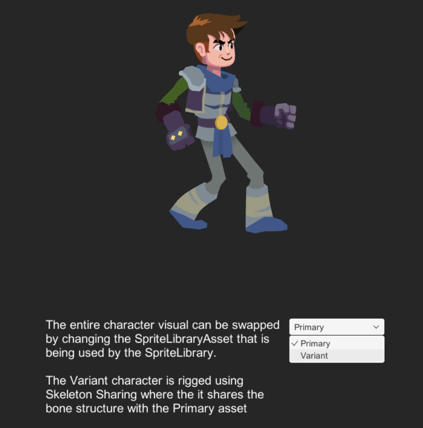
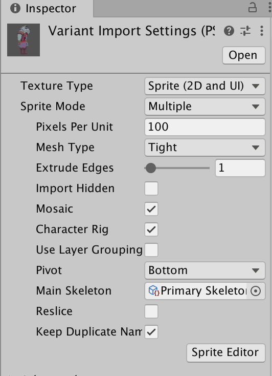
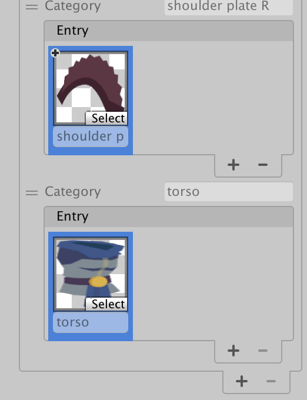

# Skeleton Sharing

This example shows how Skeleton Sharing can be set up and leverages on the examples before this. The example requires the PSD Importer package to be installed. Open the `5 Skeleton Sharing` Scene to see it in action.

The example setup is the same as the [Full Skin Swap](#full-skin-swap) example. However instead of using Multi Skinned Sprites, the example uses the Prefab generated by the PSD Importer. The art assets are located in `Assets/Samples/2D Animation/[X.Y.Z]/Samples/5 SpriteSwap/Sprites`:

1. `Primary.psb`

2. `Variant.psb`

The `Variant.psb` is set up to use the Skeleton asset from the `Primary.psb` to showcase that the `Variant.psb` is prepared using the same skeleton structure as the `Primary.psb`.

It also uses the following Sprite Library Asset located in `Assets/Samples/2D Animation/[X.Y.Z]/Samples/5 SpriteSwap/Sprites`:

1. `Primary.spriteLib`

2. `Variant.spriteLib`

The `Variant.spriteLib` is set up to use the `Primary.spriteLib` as the Main Library property. In the `Variant.spriteLib`, it is also set up purposely that the **torso** category is not overridden so that it uses the Sprite from `Primary.spriteLib`.

