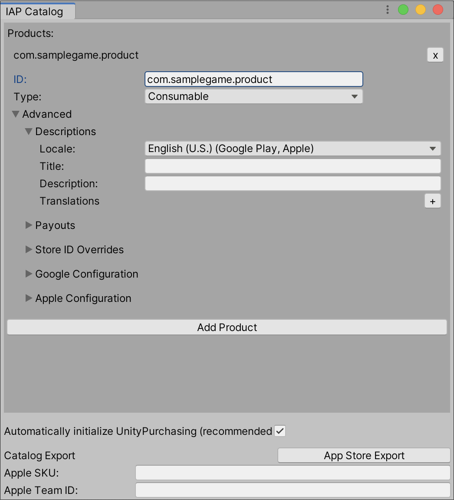
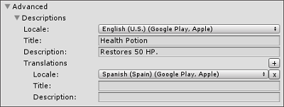
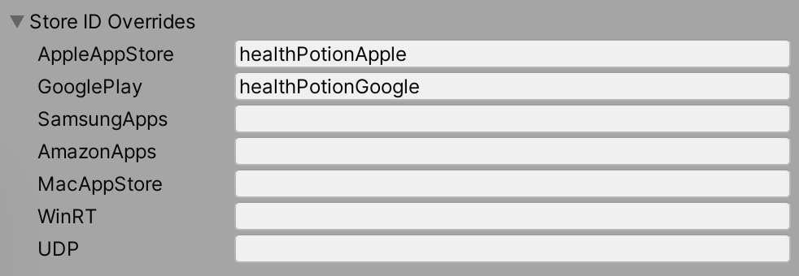

# Defining products

In order to use in-app purchases, your app must provide a list of Products for sale. You can do this through scripting, or using the [**Codeless IAP Catalog**](UnityIAPCodelessIAP) (__Window__ &gt; __Unity IAP__ &gt; __IAP Catalog__). Whichever implementation you use, you must define the appropriate attributes for each Product. This page covers these attributes in detail.



## Product ID
Enter a cross-platform unique identifier to serve as the Product’s default ID when communicating with an app store. 

**Important**: The ID may only contain lowercase letters, numbers, underscores, or periods.

## Product Type
Each Product must be of one of the following Types:

| **Type** | **Description** | **Examples** |
|:---|:---|:---|
|__Consumable__| Users can purchase the Product repeatedly. Consumable Products cannot be restored. | * Virtual currencies <br/> * Health potions <br/> * Temporary power-ups. |
|__Non-Consumable__| Users can only purchased the Product once. Non-Consumable Products can be restored. | * Weapons or armor <br/> * Access to extra content|
|__Subscription__|Users can access the Product for a finite period of time. Subscription Products can be restored. | * Monthly access to an online game <br/> * VIP status granting daily bonuses <br/> * A free trial |

**Note**: For more information on Subscription type support, see the section on [**Subscription Product support**](UnityIAPSubscriptionProducts).

## Advanced
This section defines the metadata associated with your Product for use in an in-game store.

### Descriptions
Use the following fields to add descriptive text for your Product:

| **Field** | **Data type** | **Description** | **Example** |
|:---|:---|:---|:---|
| __Product Locale__ | Enum | Determines the app stores available in your region. | **English (U.S.)** (Google Play, Apple) |
| __Product Title__ | String | The name of your Product as it appears in an app store. | “Health Potion” |
| __Product Description__ | String | The descriptive text for your Product as it appears in an app store, usually an explanation of what the Product is. | “Restores 50 HP.” | 

Add __Translations__ for the __Title__ and __Description__ fields by clicking the plus (__+__) icon and selecting an additional locale. You can add as many translations as you like.



### Payouts
Use this section to add local, fixed definitions for the content you pay out to the purchaser. Payouts make it easier to manage in-game wallets or inventories. By labeling a Product with a name and quantity, developers can quickly adjust in-game counts of certain item types upon purchase (for example, coins or gems).

**Note**: This functionality is only available in Unity 2017.2 or higher. 

| **Field** | **Data type** | **Description** | **Example** |
|:---|:---|:---|:---|
| __Payout Type__ | Enum | Defines the category of content the purchaser receives. There are four possible Types. | * Currency <br/> * Item<br/> * Resource <br/> * Other|
| __Payout Subtype__ | String | Provides a level of granularity to the content category. |* “Gold” and “Silver” subtypes of a __Currency__ type <br/> * “Potion” and “Boost” subtypes of an __Item__ type |
| __Quantity__ | Int | Specifies the number of items, currency, and so on, that the purchaser receives in the payout. | * 1 <br/> * &gt;25<br/>* 100|
| __Data__ | | Use this field any way you like as a property to reference in code. | * Flag for a UI element<br/> * Item rarity |  


**Note**: You can add multiple Payouts to a single Product. 

For more information on the PayoutDefinition class, see the [Scripting Reference](ScriptRef:Purchasing.PayoutDefinition.html). You can always add Payout information to a Product in a script using this class. For example:

```
using UnityEngine.Purchasing;

new PayoutDefinition (PayoutType.Currency, "Gold", 100)
```

Note that the IAP Catalog acts as a Product catalog dictionary, not as an inventory manager. You must still implement the code that handles conveyance of the purchased content. 

### Store ID Overrides
By default, Unity IAP assumes that your Product has the same identifier (specified in the **ID** field, above) across all app stores. Unity recommends doing this where possible. However, there are occasions when this is not possible, such as when publishing to both iOS and Mac stores, which prohibit developers from using the same product ID across both.

In these cases, use the override fields to specify the Product's correct identifier where it differs from the cross-platform ID.



You can also do this programmatically, as follows:

````
using UnityEngine;
using UnityEngine.Purchasing;

public class MyIAPManager {
    public MyIAPManager () {
        var builder = ConfigurationBuilder.Instance(StandardPurchasingModule.Instance());
        builder.AddProduct("100_gold_coins", ProductType.Consumable, new IDs
        {
            {"100_gold_coins_google", GooglePlay.Name},
            {"100_gold_coins_mac", MacAppStore.Name}
        });
        // Initialize Unity IAP...
    }
}
````

In this example, the Product identifies as "100_gold_coins_google" to Google Play and "100_gold_coins_mac" to the Apple App Store.

**Note**: Overrides only change the identifier Unity IAP uses when communicating with app stores. You should still use the Product's cross-platform identifier when making API calls.

**Important**: The ID may only contain lowercase letters, numbers, underscores, or periods. 

### Google Configuration (required for Google Play export)
Provide either a Product price, or an ID for a [Pricing Template](https://support.google.com/googleplay/android-developer/answer/6334373) created in Google Play.


### Apple Configuration (required for Apple export)
Select a **Pricing Tier** from the dropdown menu. Unity supports predefined Apple price points, but not arbitrary values.

__Select a screenshot__ to upload. 

For information on screenshot specs, see Apple’s publisher support documentation.


## Defining Products in scripts
You can also declare your Product list programmatically using the [Purchasing Configuration Builder](ScriptRef:Purchasing.ConfigurationBuilder.html). You must provide a unique cross-store __Product ID__ and __Product Type__ for each Product:

````
using UnityEngine;
using UnityEngine.Purchasing;

public class MyIAPManager {
    public MyIAPManager () {
        var builder = ConfigurationBuilder.Instance(StandardPurchasingModule.Instance());
        builder.AddProduct("100_gold_coins", ProductType.Consumable);
        // Initialize Unity IAP...
    }
}
````


